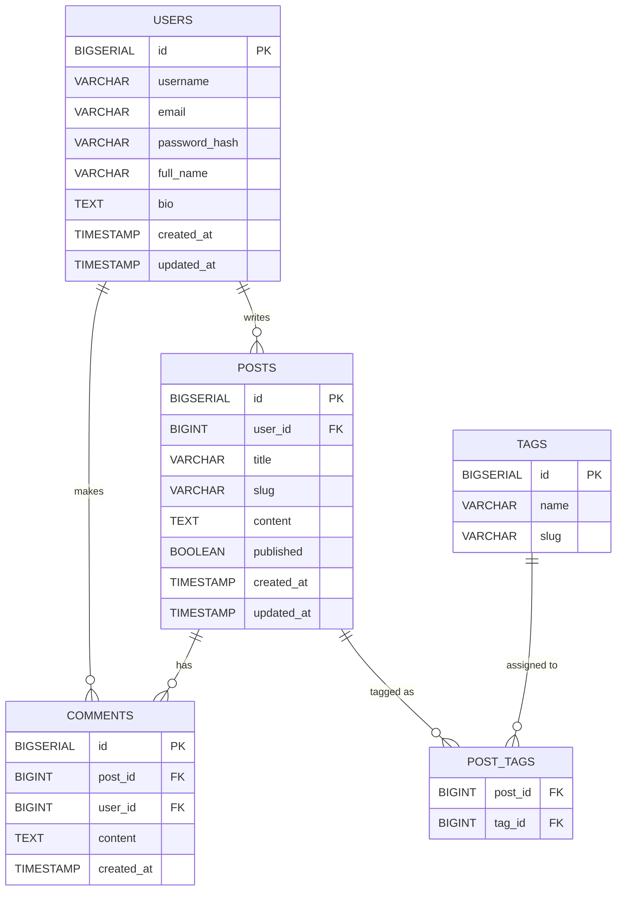

# 🧱 Blog Platform Database Schema

This repository contains a **PostgreSQL schema** for a simple yet scalable **blog platform**, designed with best practices for clarity, performance, and extensibility.

---

## 📘 Overview

The platform supports the following entities:

- **Users** – authors and commenters  
- **Posts** – blog publications  
- **Comments** – feedback from users  
- **Tags** – post categorization  
- **Post_Tags** – many-to-many relationship between posts and tags  

---

## 🧩 ER Diagram (Mermaid)



---

## 🧱 Schema Structure

The full schema is defined in [`schema.sql`](./schema.sql).  
It includes:

- Primary and foreign keys  
- Cascading rules (`ON DELETE CASCADE` / `ON DELETE SET NULL`)  
- Indexed fields for frequent queries (`slug`, `username`, `post_id`)  
- Timezone-safe timestamps  

---

## ⚙️ Installation & Usage

### 1️⃣ Requirements
- PostgreSQL ≥ 14
- psql client installed

### 2️⃣ Create the Database
```bash
createdb blog_platform
```

### 3️⃣ Apply Schema
```bash
psql -d blog_platform -f schema.sql
```

### 4️⃣ Verify Tables
```bash
\dt
```

### 5️⃣ Optional: Insert Example Data
```sql
INSERT INTO users (username, email, password_hash)
VALUES ('admin', 'admin@example.com', 'hashed_password');
```

---

## 🧬 Design Rationale

| Concept | Decision |
|----------|-----------|
| **Timestamps** | `TIMESTAMP WITH TIME ZONE` for timezone safety |
| **Deletions** | `CASCADE` on dependent entities; comments retain history via `SET NULL` |
| **Extensibility** | Easy to add likes, media, or categories |
| **Performance** | Indexed frequent filters (slug, username, post_id) |
| **Normalization** | Full 3NF, no redundant data |

---

## 🧑‍💻 Author

**Daniel Sarmiento**  
Senior Full Stack Engineer  
2025 © All rights reserved

---

## 🌐 Localization

Spanish version available at: [README_ES.md](./README_ES.md)