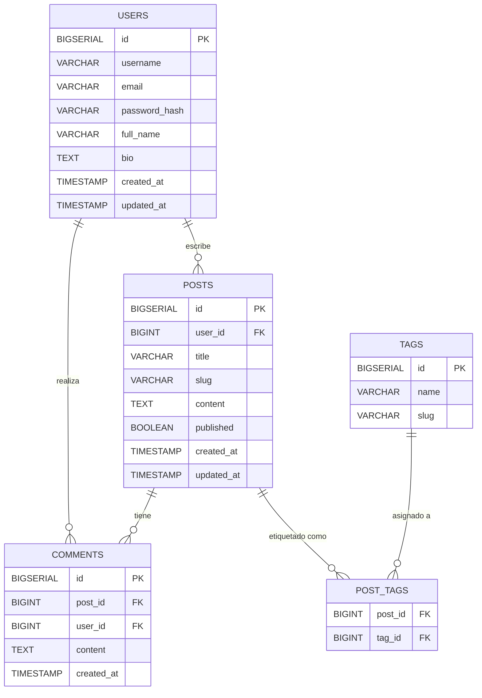

# 🧱 Blog Platform Database Schema

This repository contains a **PostgreSQL schema** for a simple yet scalable **blog platform**, designed with best practices for clarity, performance, and extensibility.

---

## 📘 Overview

The platform supports the following entities:

- **Users** – authors and commenters  
- **Posts** – blog publications  
- **Comments** – feedback from users  
- **Tags** – post categorization  
- **Post_Tags** – many-to-many relationship between posts and tags  

---

## 🧩 ER Diagram (Mermaid)

```mermaid
erDiagram

    USERS ||--o{ POSTS : "writes"
    USERS ||--o{ COMMENTS : "makes"

    POSTS ||--o{ COMMENTS : "has"
    POSTS ||--o{ POST_TAGS : "tagged as"

    TAGS ||--o{ POST_TAGS : "assigned to"

    USERS {
        BIGSERIAL id PK
        VARCHAR username
        VARCHAR email
        VARCHAR password_hash
        VARCHAR full_name
        TEXT bio
        TIMESTAMP created_at
        TIMESTAMP updated_at
    }

    POSTS {
        BIGSERIAL id PK
        BIGINT user_id FK
        VARCHAR title
        VARCHAR slug
        TEXT content
        BOOLEAN published
        TIMESTAMP created_at
        TIMESTAMP updated_at
    }

    COMMENTS {
        BIGSERIAL id PK
        BIGINT post_id FK
        BIGINT user_id FK
   W     TEXT content
        TIMESTAMP created_at
    }

    TAGS {
        BIGSERIAL id PK
        VARCHAR name
        VARCHAR slug
    }

    POST_TAGS {
        BIGINT post_id FK
        BIGINT tag_id FK
    }
```

---

## 🧱 Schema Structure

The full schema is defined in [`schema.sql`](./schema.sql).  
It includes:

- Primary and foreign keys  
- Cascading rules (`ON DELETE CASCADE` / `ON DELETE SET NULL`)  
- Indexed fields for frequent queries (`slug`, `username`, `post_id`)  
- Timezone-safe timestamps  

---

## ⚙️ Installation & Usage

### 1️⃣ Requirements
- PostgreSQL ≥ 14
- psql client installed

### 2️⃣ Create the Database
```bash
createdb blog_platform
```

### 3️⃣ Apply Schema
```bash
psql -d blog_platform -f schema.sql
```

### 4️⃣ Verify Tables
```bash
\dt
```

### 5️⃣ Optional: Insert Example Data
```sql
INSERT INTO users (username, email, password_hash)
VALUES ('admin', 'admin@example.com', 'hashed_password');
```

---

## 🧬 Design Rationale

| Concept | Decision |
|----------|-----------|
| **Timestamps** | `TIMESTAMP WITH TIME ZONE` for timezone safety |
| **Deletions** | `CASCADE` on dependent entities; comments retain history via `SET NULL` |
| **Extensibility** | Easy to add likes, media, or categories |
| **Performance** | Indexed frequent filters (slug, username, post_id) |
| **Normalization** | Full 3NF, no redundant data |

---

## 🧑‍💻 Author

**Daniel Sarmiento**  
Senior Full Stack Engineer  
2025 © All rights reserved

---

## 🌐 Localization

Spanish version available at: [README_ES.md](./README_ES.md)
```

---

### File: `README_ES.md`

```markdown
# 🧱 Esquema de Base de Datos – Plataforma de Blogs

Este repositorio contiene un **esquema de base de datos PostgreSQL** para una plataforma de blogs simple pero escalable, diseñado con buenas prácticas de arquitectura y rendimiento.

---

## 📘 Descripción General

La plataforma incluye las siguientes entidades:

- **Usuarios** – autores y comentaristas  
- **Publicaciones (Posts)** – artículos del blog  
- **Comentarios** – opiniones de los usuarios  
- **Etiquetas (Tags)** – categorías de los posts  
- **Post_Tags** – relación muchos a muchos entre publicaciones y etiquetas  

---

## 🧩 Diagrama ER (Mermaid)



---

## 🧱 Estructura del Esquema

Definido en [`schema.sql`](./schema.sql):

- Llaves primarias y foráneas  
- Reglas de borrado en cascada (`ON DELETE CASCADE` / `SET NULL`)  
- Campos indexados para consultas frecuentes (`slug`, `username`, `post_id`)  
- Timestamps con zona horaria  

---

## ⚙️ Instalación y Uso

### 1️⃣ Requisitos
- PostgreSQL ≥ 14  
- Cliente `psql` instalado

### 2️⃣ Crear la base de datos
```bash
createdb blog_platform
```

### 3️⃣ Aplicar el esquema
```bash
psql -d blog_platform -f schema.sql
```

### 4️⃣ Verificar tablas
```bash
\dt
```

### 5️⃣ (Opcional) Insertar datos de ejemplo
```sql
INSERT INTO users (username, email, password_hash)
VALUES ('admin', 'admin@example.com', 'hashed_password');
```

---

## 🧬 Decisiones de Diseño

| Concepto | Decisión |
|-----------|-----------|
| **Timestamps** | Uso de `TIMESTAMP WITH TIME ZONE` |
| **Eliminaciones** | Cascada en dependencias, `SET NULL` en comentarios |
| **Extensibilidad** | Permite agregar likes, media o categorías |
| **Rendimiento** | Índices en campos de búsqueda frecuente |
| **Normalización** | Esquema en 3FN sin redundancia |

---

## 🧑‍💻 Autor

**Daniel Sarmiento**  
Ingeniero Senior Full Stack  
2025 © Todos los derechos reservados

---

## 🌍 Localización

Versión en inglés disponible en: [README.md](./README.md)